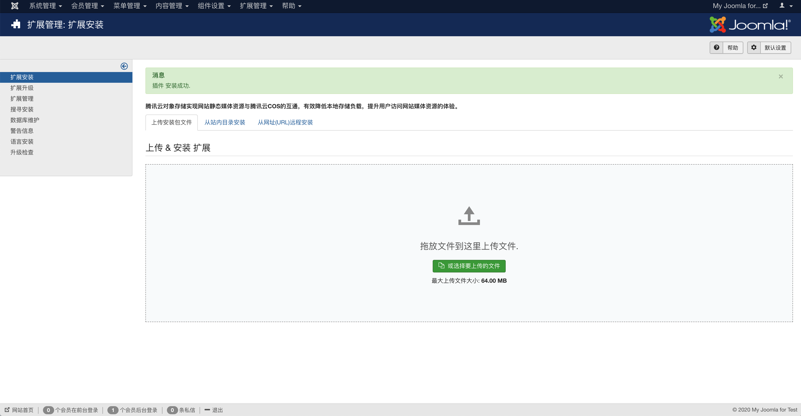

# 腾讯云文本内容安全插件

## 0.版本依赖

- 依赖 PHP 5.6+ 环境

- GuzzleHttp 6.3.0+ (如果有其它插件引用了 GuzzleHttp 库并低于 6.3.0 版本会引起插件冲突)

## 1.插件介绍

> tencentcloud-tms插件是一款腾讯云研发的，提供给Joomla站长使用的官方插件。能对用户在创建文章时提交的文字出现违规涉黄、爆、恐的内容，进行内容检测和过滤功能。

| 标题       | 名称                                                         |
| ---------- | ------------------------------------------------------------ |
| 中文名称   | 腾讯云文本内容安全（TMS）插件                                  |
| 英文名称   | tencentcloud-tms                                         |
| 最新版本   | v1.0.1 (2020.12.22)                                          |
| 适用平台   | [Joomla](https://joomla.org/)                          |
| 适用产品   | [腾讯云文本内容安全（TMS）](https://cloud.tencent.com/product/tms) |
| GitHub项目 | [tencentcloud-joomla-plugin-tms](https://github.com/Tencent-Cloud-Plugins/tencentcloud-joomla-plugin-tms) |
| 文档中心   | [云插件文档中心](https://openapp.qq.com/docs/joomla/tms.html) |
| 主创团队   | 腾讯云中小企业产品中心（SMB Product Center of Tencent Cloud） |

## 2.功能特性
- 普通用户登录Joomla网站,在首页中通过"Create a Post"创建文章，会对文章的名称、别名、内容、元描述、元关键字进行检查。
- 超级管理元登录Joomla网站井进入后台控制面板->添加文章，会对文章内容中的名称、别名、内容、图片和链接中的图片替代文章、图片说明、链接、链接文字和发布选项中元描述、元关键字进行检查。

## 3.安装指引

### 3.1.部署方式一：通过GitHub部署安装

> 1. 执行git clone git@git.code.oa.com:qcloud-rain/joomla.git 将项目克隆下来
> 2. 用压缩工具对 tencentcloud_tms文件夹压缩成zip文件（如tencentcloud_tms.zip）
> 3. 进入自己搭建的joomla网站后台，切换到“扩展管理”中的“扩展安装”，将上一步生成的zip文件上传（拖放）到安装文件上传入口。
> 4. 在网站后台“扩展管理”的“插件管理”中可以找到安装好的腾讯云文本内容安全插件，可开启、关闭和点击进入配置页面进行编辑。

## 4.使用指引

### 4.1. 页面功能介绍

> 在【扩展管理】->【插件安装】 -> 【扩展安装】中，上传腾讯云插件安装包。

  

> 在【扩展管理】->【插件管理】中，选中腾讯云文本内容安全插件，配置成"启用"状态。 

  

> 在【扩展管理】->【插件管理】中，选择腾讯云文本内容安全插件，配置插件需要的相关信息。 

  

> 新增敏感词白名单。白名单中的关键词将不会做内容安全检查。 

  

> 普通用户登录站点->【Create a Post】创建文章，在文章的名称、别名、内容、元描述、元关键字填入违规内容。

  

> 超级管理员登录站点->【Site Administrator】添加文章，在文章内容中的名称、别名、内容、图片或链接中的图片替代文章、图片说明、链接、链接文字和或布选项中元描述、元关键字填入违规内容。

### 4.2. 名词解释

- **SecretId**：在腾讯云云平台API密钥上申请的标识身份的 SecretId。详情参考[腾讯云文档](https://cloud.tencent.com/document/product)
- **SecretKey**：在腾讯云云平台API密钥上申请的标识身份的SecretId对应的SecretKey。详情参考[腾讯云文档](https://cloud.tencent.com/document/product)

## 5.FAQ

## 6.GitHub版本迭代记录
### 2020.12.22 tencentcloud-joomla-plugin-tms v1.0.1
- 新增敏感词白名单

### 2020.11.12 tencentcloud-joomla-plugin-tms v1.0.0
- 普通用户登录Joomla网站,在首页中通过"Create a Post"创建文章，会对文章的名称、别名、内容、元描述、元关键字进行检查。
- 超级管理元登录Joomla网站井进入后台控制面板->添加文章，会对文章内容中的名称、别名、内容、图片和链接中的图片替代文章、图片说明、链接、链接文字和发布选项中元描述、元关键字进行检查。

本项目由腾讯云中小企业产品中心建设和维护，了解与该插件使用相关的更多信息，请访问[春雨文档中心](https://openapp.qq.com/docs/DiscuzX/tms.html) 

请通过[咨询建议](https://da.do/y0rp) 向我们提交宝贵意见。